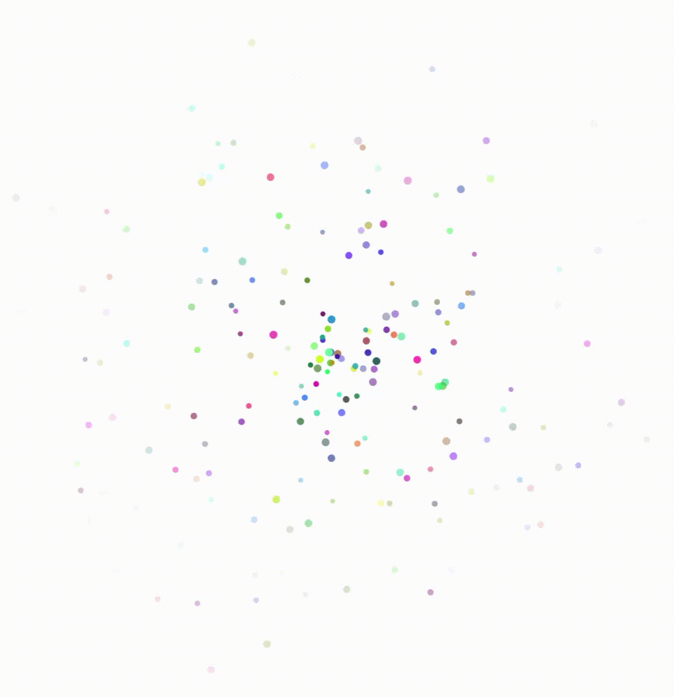
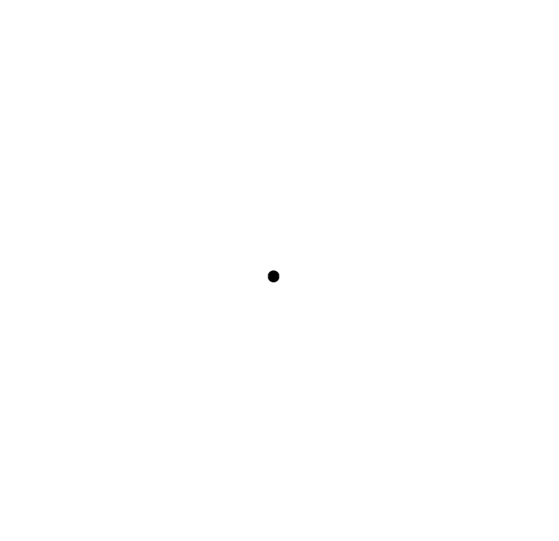
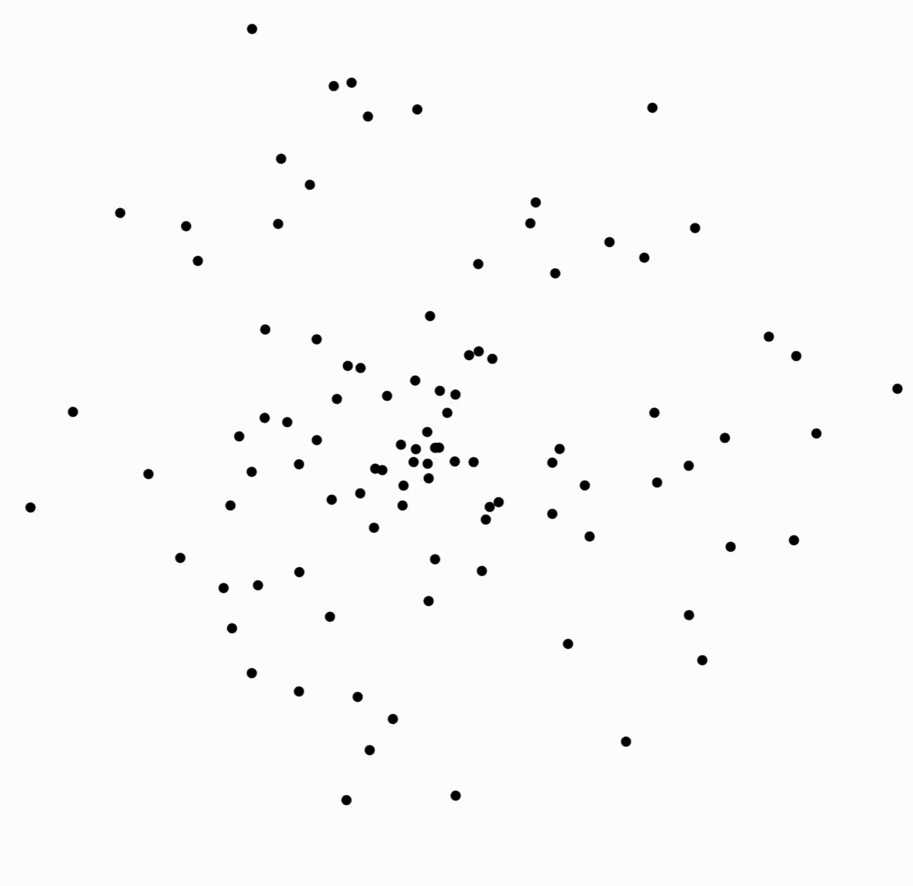
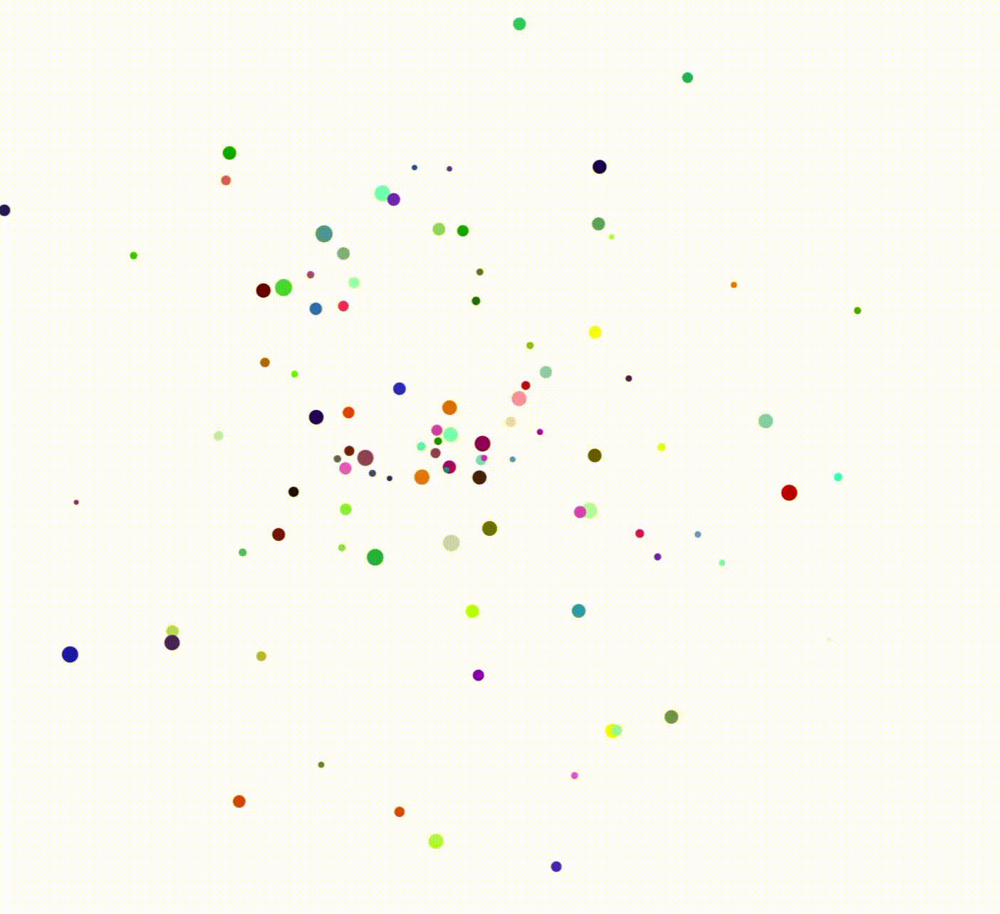
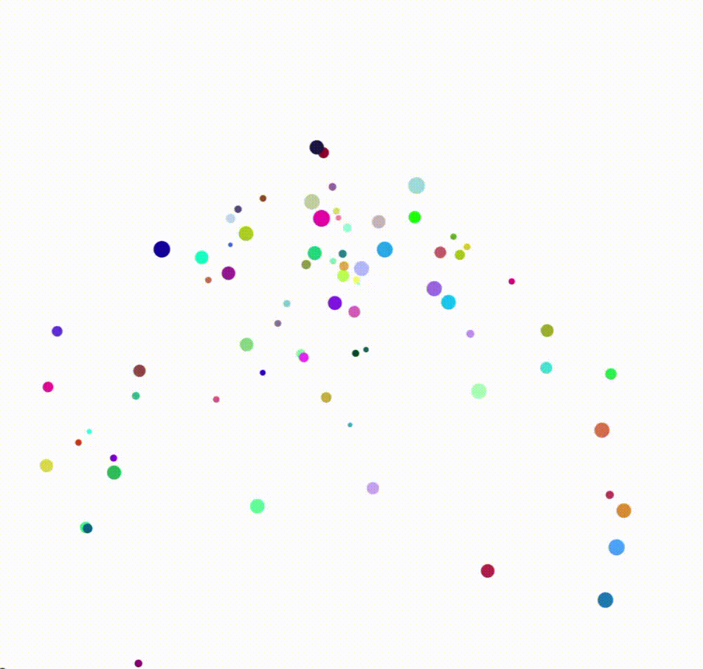
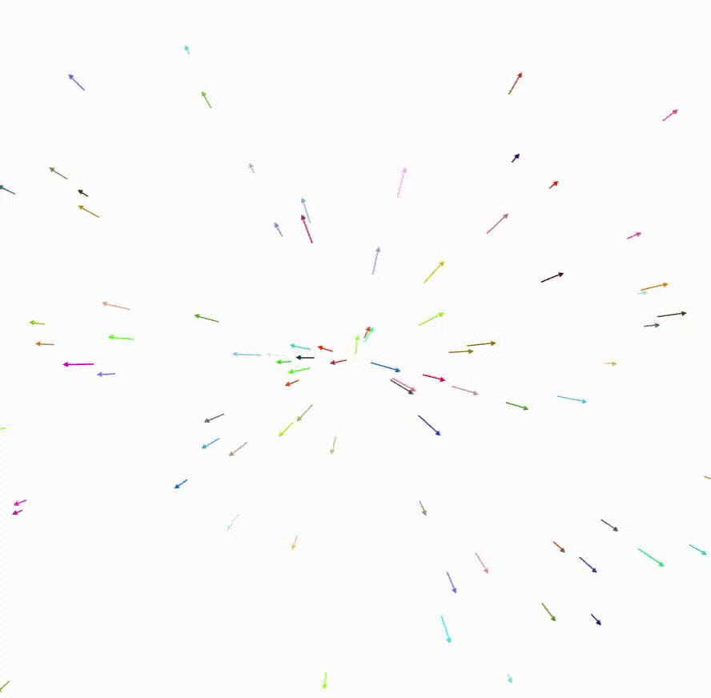
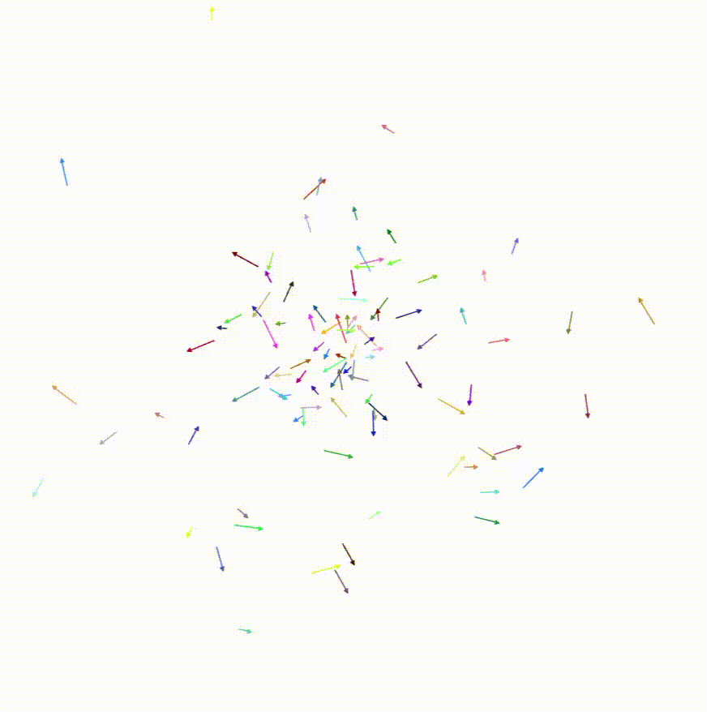

<style>
    h1, h2, h3 {
        border-bottom: 1px grey solid;
        padding-bottom: 0.2em;
    }

    h1 {
        font-size: 1.7em !important;
    }

    h2 {
        font-size: 1.3em !important;
    }

    h3 {
        color: #333 !important;
        font-size: 1.15em !important;
    }

    h4 {
        color: #444 !important;
        font-size: 1.1em !important;
    }

    :root {
        --radius: 0.4em;
    }

    figure {
        float: right;
        display: flex;
        flex-direction: column;
        align-items: center;
        img {
            width: 2.3in;
            aspect-ratio: 1/1;
            object-fit: cover;
            object-position: 50% 50%;
            border: 1px black solid;
        }

        figcaption {
            font-style: italic;
            text-align: center;
        }
    }

    .figure-container {
        float: right;
        figure {
            float: none;
        }
    }

    /* code:not([class]) {
        color: #777;
    } */

    .box {
        padding: 0.5em;
        border-radius: var(--radius);
        margin-bottom: 0.75em;
        box-shadow: 0px 1px 5px rgba(0, 0, 0, 0.2);

        > * {
            margin: 0;
        }

        p::before {
            font-weight: bold;
            color: black;
        }

        &.note {
            /* border: 1px black solid; */
            background: #bec;
            p::before { content: "Note: "; }
        }
        &.caution {
            background: #ff9;
            /* border: 1px black solid; */
            p::before { content: "⚠️Warning: "; }
        }


    }

    .clearfix {
        clear: both;
        overflow: auto;
    }
</style>

# How to Create a Hengine Particle System
<figure>
    
    <figcaption>Figure 1: the goal</figcaption>
</figure>

This document provides guidance on creating a basic, customizable particle system using the [Hengine](https://www.github.com/Elkwizard/Hengine) web game engine and the [JavaScript](https://developer.mozilla.org/en-US/docs/Web/JavaScript) programming language. In particular, it covers the basics of **2D** particle systems, including their graphics, physics, and implementation in one engine. By the end of this process, you will have created a particle system similar to the one shown in Figure 1. Notably, this does not discuss JavaScript syntax or semantics, nor the fundamentals of computer graphics or classical physics.

<div class="clearfix"></div>

## Prerequisites
You need a few things before you can get started. Unfortunately, some of these take months or years to acquire. The prerequisites are listed below, in decreasing order of difficulty:

1. 1-2 hours of free time
2. Proficiency in JavaScript syntax and semantics (HTML and CSS knowledge are not necessary)
3. Basic knowledge of physical concepts like position, velocity, and acceleration
4. Very basic knowledge of integral and differential calculus
5. A computer, with:
    * Internet access (not necessarily reliable)
    * A text editor: VSCode, Notepad++, XCode, etc.
    * A browser: Chrome, Firefox, or Edge work best.

<div class="note box">

If you don't meet the first few requirements but are interested in doing so, the websites [MDN](https://developer.mozilla.org) and [Learn OpenGL](https://learnopengl.com) are excellent resources for learning the basics of JavaScript and computer graphics. 
</div>

## Creating the Particle System
Now that you have gathered your supplies, you can begin the project. The process is divided into four broad phases. An overview of those phases is given here, but if you are okay with surprises, you can safely skip this summary.
1. In the first phase, you will use the Hengine's shorthand project system to quickly create an environment in which you can develop the particles.
2. In the second phase, you will learn the basics of the Hengine's object system, and use it to construct an empty particle spawner.
3. In the third phase, you will learn how to create an increasingly interesting but generic particle system, similar to the one shown in Figure 1.
4. In the final (optional) phase, you will be exposed to various techniques for customizing and improving the visuals of your particle system.

Let's begin!

### Phase 1: Creating the Project
Creating a new project in the Hengine is extremely simple if you have consistent internet access:

1. **Create a blank text file with the `.html` extension** (e.g. `myParticles.html`) using your text editor of choice. Save this file to your computer.
2. Within the file, **add the following HTML:**
    ```html
    <script src="https://elkwizard.github.io/Hengine/Hengine.js">
        // this is where the rest of your code will go
    </script>
    ```
3. **Open the file in your browser of choice.** It displays a blank white screen.

<div class="note box">

Keep this browser tab open for the duration of the project. If you make changes to your code and the program seems to behave the same, remember to save your file and reload the tab. Additionally, if things don't seem to be working properly, open the developer console (with Right Click + Inspect, Ctrl/Cmd + Shift + J, or F12) to see possible error messages.
</div>

<div class="caution box">

If you do not have consistent internet access, then your program will fail to run. If you have [Git](https://git-scm.com/install/) installed, you can avoid this by running `git clone https://www.github.com/Elkwizard/Hengine.git` to get a local copy of the engine. Then, update the above HTML to reference the `Hengine.js` file in the root of your local copy, rather than the one at `https://...`. This avoids the need for repeated network requests.

</div>

### (Optional) Particles: Conceptual Background
The fundamental concept behind creating a particle effect like the one in Figure 1 is that of the "particle spawner". A particle spawner is an imaginary "object" which exists at a given location and emits particles over time. Each particle then becomes an independent entity with its own motion and behavior which (in most cases) eventually decays and is deleted. By repeating this process, an infinite stream of particles can be created without consuming infinite memory and processing power.

### Phase 2: Creating a Basic System
In the Hengine, the world consists of a set of `WorldObject`s, each of which can appear on the screen and respond to various events from the user or the engine. Collections of event-responses or "behaviors" are encapsulated into the `ElementScript` class. To create your particle system, you will create an object to act as a spawner, and then give it the Hengine's built-in particle management behaviors.

1. **Create a new object to act as your spawner**, by adding the following code in between the `<script>` tags of your HTML file from phase 1:
    ```js
    const spawner = scene.main.addElement(
        "particleSpawner",
        width / 2, height / 2
    );
    ```
    The second and third arguments to `addElement()` specify the x- and y-coordinates of the object, which in this case is the middle of the screen.
2. **Give the spawner object the particle spawning behavior** with:
    ```js
    spawner.scripts.add(PARTICLE_SPAWNER, {
        // options will go here
    });
    ```

<div class="note box">

After completing this phase and reloading the page, you should still just see a white page. This is expected behavior! The spawner is invisible and so are its particles, so there's nothing to see yet.
</div>

### Phase 3: Making It Visible
Now that you have a particle spawner, invisible though it may be, you've reached the fun part! The rest of this guide will be spent in the object literal argument to `spawner.scripts.add()`, which is used to provide custom particle behavior.

<div class="figure-container">
    <figure>
        
        <figcaption>Figure 2: your first particle</figcaption>
    </figure>
    <figure>
        
        <figcaption>Figure 3: randomized velocities</figcaption>
    </figure>
    <figure>
        
        <figcaption>Figure 4: randomized user data</figcaption>
    </figure>
</div>

1. **Add a function called `draw` to the object literal to render your particles.** It needs two arguments:
    * `renderer`: This provides methods for drawing shapes on the screen.
    * `particle`: This is an object representing an individual particle. This `draw` method is be called every frame for every particle, and should render that particle to the screen.
    
    A good starting point is this function, which draws each particle as a black filled-in circle with a 5-pixel radius. If you have done everything correctly, you see a small black dot (Figure 2).
    ```js
    draw(renderer, particle) {
        renderer
            .draw(Color.BLACK)
            .circle(particle.position, 5);
    },
    ```

2. **Give your particles velocity by creating an `init` function in the object literal.** `init` is be called to initialize each particle when it first spawns. The `init` shown below gives each particle a velocity in a random direction with a speed between 3 and 5 pixels per frame. After reloading, you now see moving dots (Figure 3).
    ```js
    init(particle) {
        particle.velocity = Vector2.polar(
            Random.angle(),
            Random.range(3, 5)
        );
    },
    ```

3. **Give your particles variation by adding custom per-particle data.** Each particle object has an embedded `.data` object which can be used to store whatever you want. To wrap up this phase, add `.color` and `.radius` data to your particles in `init`, and then use that information in `draw`. By again using `Random`, we can give each particle a random color and a radius between 2 and 8 pixels. After implementing this correctly, you should see something very similar to Figure 1!
    ```js
    // in init (after current code)
    particle.data.color = Random.color();
    particle.data.radius = Random.range(2, 8);

    // in draw (replacing current code)
    renderer
        .draw(particle.data.color)
        .circle(particle.position, particle.data.radius);
    ```

<div class="clearfix"></div>

<div class="note box">

For more information on the particle system API, as well as the available methods on `renderer` and `particle`, see the [Hengine Documentation](https://elkwizard.github.io/Hengine). In particular, information about `renderer` can be found under `Artist2D`, and information about `particle` can be found under `PARTICLE_SYSTEM`.
</div>	

### (Optional) Phase 4: Further Customization
This section is unordered and optional. Feel free to complete any of these tasks that appeal to you, in any order.
#### Adding Gravity
<figure>
    
    <figcaption>Figure 5: falling particles</figcaption>
</figure>

To make your particles fall, simply:

1. **Add `falls: true,` to the object literal,** alongside `init` and `draw`.
1. If you want to customize the gravitational acceleration, **set it in the global scope** at the top of the file. The gravity value has units of pixels per frame<sup>2</sup>.
    ```js
    // values between 0.1 and 1 typically work best 
    scene.physics.gravity.y = 0.1;

    // the rest of the file (no changes needed)
    const spawner = ...
    spawner.scripts.add(PARTICLE_SPAWNER, ...
    ```

If you have completed these steps correctly, your particles are now moving in downward parabolic arcs, as shown in Figure 5.

#### Fading the Particles Over Time
To make your particles fade, you need information about where they are in their life cycle. This comes in the form of `particle.timer`, a value which interpolates from 0 to 1 over the course of the particle's life. Thus, to make the particles fade:

1. **Add `renderer.alpha = 1 - particle.timer;` to the beginning of `draw`'s body.** This causes the opacity to linearly decrease over the particle's lifetime.
1. For more natural-looking fading behavior, **try easing functions in the `Interpolation` class.** For example, the following code concentrates the fade-out later in the particle's life:
    ```js
    renderer.alpha = 1 - Interpolation.increasing(particle.timer);
    ```

If you have followed these steps correctly, your particles now gradually fade out rather than vanishing.

<div class="clearfix"></div>

<div class="caution box">

If you have been exploring various other options of the particle system, this example code may produce an unsightly "popping" effect where nearly-invisible particles reappear for a single frame. This is due to floating-point errors and can be avoided by wrapping your `1 - ...` in `Math.max(0, 1 - ...)`.
</div>

#### Customizing the Particles' Shape
The Hengine's support for [many non-circle shapes](https://elkwizard.github.io/Hengine) can be found under `Artist2D`, `DrawRenderer`, and `StrokeRenderer`. To get started with them, the following example explains how to transform your particles into small "vectors" pointing in their direction of motion.

<figure>
    
    <figcaption>Figure 6: custom shapes</figcaption>
</figure>

1. **Compute the direction of motion** at the top of `draw()`. Conveniently enough, this is just the direction (normalization) of `particle.velocity`:
    ```js
    const direction = particle.velocity.normalized;
    ```
1. **Replace your `renderer.draw...circle` statement with a `renderer.stroke...arrow` statement.** You can re-use your custom `data.radius` property to make the arrows have varying lengths:
    ```js
    // in draw (replacing renderer.draw...)
    // length is scaled up to be more visible
    const length = particle.data.radius * 3;
    const start = particle.position;
    const end = start.plus(direction.times(length));
    renderer
        .stroke(particle.data.color)
        .arrow(start, end);
    ```

If you have followed these steps correctly, you now have a colorful vector field as shown in Figure 6!

#### Applying Custom Movement
One good way to diversify the appearance of your particles is to change their movement after they spawn. This is achieved in the Hengine through the use of an `update(particle)` function which is called on each time step. Within this function, the entire JavaScript language and Hengine libraries at your disposal. Below is one example of this function:
<figure>
    
    <figcaption>Figure 7: changing velocities</figcaption>
</figure>

1. **Add an `update(particle)` function to the object literal.**
    ```js
    update(particle) {
        // this is run every frame
    },
    ```
2. **Change the particle's movement occasionally.** Insert the following code into `update(particle)`:
    ```js
    // in update
    if (Random.bool(0.1)) // 10% chance each frame
        particle.velocity.angle = Random.angle();
    ```

If you have followed these steps correctly, you now have a cloud of redirecting particles, as seen in Figure 7 (shown with the previous section's custom shapes). Crucially, this is just one example; there are infinitely many ways to use `update` and experimentation is a great way to learn them all.

## Congratulations!
<figure>
    
    <figcaption>Figure 8: endless possibilities </figcaption>
</figure>
You now have a particle system with a multitude of features! No matter how many aspects of the system you pursued, this program will forever serve as an environment for creative experimentation with JavaScript in a visual context. Good luck and farewell!